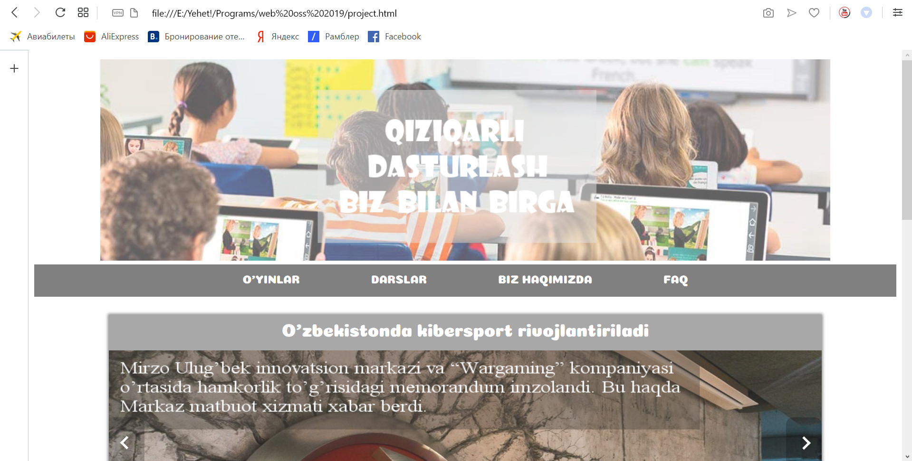
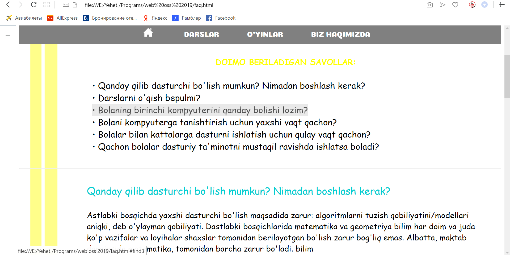

# Quvnoq Dasturlash Website
## This website is for Learning Coding for Uzbek People. 

It was created using HTML, CSS, JAVA Script. 

This project was carried out in January 2019 by Students from Inha University in Tashkent and  Chungcheongbuk-do Area Leading Overseas Education Volunteer .

In Uzbekistan, where many ethnic groups live together, the teaching tools for code teaching are only made in the Russian language. Therefore, you need to know the Russian language, not the Uzbek language, so you can learn coding. Uzbek people who do not know Russian can not learn coding. So we have created a coding education site in Uzbek language for children. Uzbek children will be able to learn coding not only through written coding, but also through various play tools.
